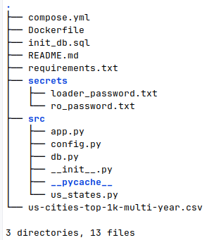
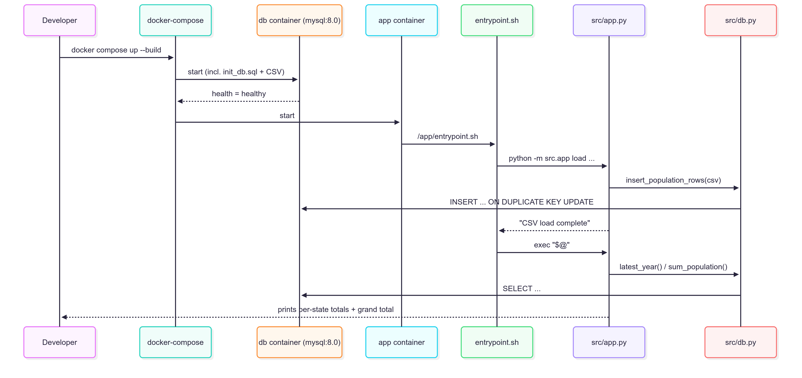

<!-- README.md – US-Cities Population Demo -->
# US Cities Population Demo

A minimal data-platform exercise that:

* spins up **MySQL 8** + a **Python 3.11** app via **Docker Compose**,
* bulk-loads a CSV of the 1 000 largest US cities (2014-2018),
* exposes a CLI that aggregates state-level population totals.

<details>
<summary>Architecture (click to expand)</summary>


</details>

## Prerequsites:
- git installed
- Docker compose installed

## Quick-start

1. Clone the repo
```bash
git clone https://github.com/your-org/us-cities-demo.git
cd us-cities-demo
```
2. Build the container, which will load the data into the database and then wait idly for queries.
```bash
docker compose up --build
```
3. Run app queries against db (second terminal)
This will get you the total population in cities for each state from the latest year (2018) for each state you supply (in this case, New Hampshire and Ohio), 
then also sum it to get the grand total. 

It also will optionally print logs at the debug level if you pass in the debug environment variable as shown, or if you have a update the .env file to have `DEBUG=true`.
```bash
docker compose run \
-e DEBUG=true \
--rm app \
python -m src.app query \
--user ro --pw-stdin \
--states "New Hampshire" OH
```

The output should look like this:
```
New Hampshire             1,559,489
Ohio                      15,538,845
----------------------------------
Grand Total               17,098,334
```


5. Once done using the container, open a new terminal up and run this command, which will stop containers and remove docker volumes from just this project.
```bash
docker compose down -v
```


# CLI Reference
To show the help:
```bash
docker compose run --rm app python -m src.app --help
```
or for the help specific to load or query, just add in `load` or `query` in front of `--help` in the above command.

The output will look like:

`python -m src.app [load|query] [options]`

`load  --file /data/cities.csv`     # default inside container

`query --states CA NY ...   `       # full name or 2-letter code

Common DB flags

  `--user USER`

  `--pw-stdin | --pw-file FILE | --password PW`

🔧 Debug logging

Either set `DEBUG=true` (env-var) or pass `--debug` and the app will emit detailed SQL / timing info.

# Environment variables
| Variable  | Default   | Purpose                  |
| --------- | --------- | ------------------------ |
| `DB_HOST` | `db`      | MySQL service host       |
| `DB_PORT` | `3306`    | … port                   |
| `DB_NAME` | `geodata` | Database name            |
| `DEBUG`   | `false`   | Turn on DEBUG-level logs |


# Developer tips

| Task                                | Command                                                |
| ----------------------------------- | ------------------------------------------------------ |
| **Run unit tests** inside the image | `docker compose run --rm app pytest -q`                |
| **Rebuild from scratch**            | `docker compose build --no-cache app`                  |
| **Poke the DB** (root user)         | `docker exec -it first_db mysql -uroot -proot geodata` |
